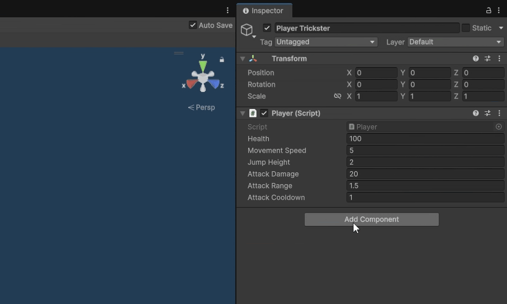

# Basic GameObject Example

```csharp
public class Player : MonoBehaviour
{
    [SerializeField, BalanceParameter("Player Health", "player_health")] private int health = 100;
    [SerializeField, BalanceParameter] private float movementSpeed = 5f;
    [SerializeField, BalanceParameter] private float jumpHeight = 2f;
    [SerializeField, BalanceParameter] private float attackDamage = 20f;
    [SerializeField, BalanceParameter] private float attackRange = 1.5f;
    [SerializeField, BalanceParameter] private float attackCooldown = 1f;
}
```

The example shows the simple usage of the `BalanceParameter` attribute in a `MonoBehaviour`.
For the GameObject using this `MonoBehaviour` to be recognized by the plugin, the `EntityDescriptorComponent` must also be added.



The `EntityDescriptorComponent` marks a GameObject as a **balanceable entity**.
It does not matter whether it is a GameObject used directly in a scene or a Prefab.

Once an object has the `EntityDescriptorComponent`, the balancing framework can recognize all fields marked with `BalanceParameter`.

!!! tip
    In many projects, entities are implemented as Prefabs.  
    This allows multiple instances of the same entity to be used in the game.
